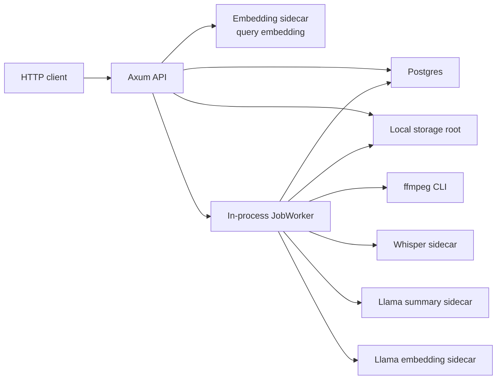

# RecordRoute Architecture

이 문서는 `RecordRoute`의 현재 코드 기준 아키텍처와 구현 상태를 기록한다. 사용자 사용법이 아니라, 저장소 구조, 런타임 구성, 모듈 경계, 데이터 흐름, 현재 구현 범위와 제약을 빠르게 파악하기 위한 참조 문서다.

## 1. 문서 범위

- 기준 코드: 루트 `rust/` 아래 `record-route-api`
- 기준 외부 의존성: `ffmpeg/`, `whisper.cpp/`, `llama.cpp/`는 서브모듈이며 애플리케이션이 직접 링크하지 않고 외부 실행 파일 또는 HTTP sidecar로 사용한다.
- 최종 기준은 항상 코드다. 이 문서는 현재 구현을 요약한 스냅샷이며, 코드 변경 시 같이 갱신하는 것을 전제로 한다.

## 2. 저장소 구성

| 경로 | 역할 |
| --- | --- |
| `rust/` | 실제 애플리케이션 코드와 테스트 |
| `rust/src/lib.rs` | 앱 부트스트랩, 설정 로드, DB 연결, migration 실행, worker 시작 |
| `rust/src/api/mod.rs` | 공개 HTTP API와 요청 검증 |
| `rust/src/jobs.rs` | 큐 polling, job claim, 재시도/실패 처리 |
| `rust/src/pipeline.rs` | ffmpeg 변환, 전사, 요약, 임베딩 파이프라인 |
| `rust/src/storage.rs` | 로컬 파일 저장, 업로드 검증, Postgres 쿼리, pgvector 검색 |
| `rust/src/sidecar_clients.rs` | whisper/llama sidecar HTTP 클라이언트 |
| `rust/src/models.rs` | API/DB 직렬화 타입, 상태 enum |
| `rust/migrations/0001_initial.sql` | 초기 스키마와 검색용 인덱스 |
| `rust/tests/mock_integration.rs` | 외부 서비스 없는 빠른 테스트 |
| `rust/tests/real_sidecar_smoke.rs` | 실사이드카 smoke placeholder |
| `ffmpeg/`, `whisper.cpp/`, `llama.cpp/` | 외부 서브모듈. 기본적으로 애플리케이션 수정 범위 밖 |

## 3. 런타임 토폴로지

현재 구조는 분리된 API 서버와 작업 큐 시스템이 아니라, 하나의 Rust 프로세스 안에 HTTP 서버와 background worker가 같이 들어있는 형태다. 업로드 요청은 DB에 job을 적재하고 `Notify`로 worker를 깨운다. 실제 비동기 처리와 검색은 모두 같은 프로세스 안에서 수행된다.

## 4. 프로세스 시작 순서

`rust/src/lib.rs` 기준 시작 순서는 다음과 같다.

1. tracing 초기화
2. 환경 변수에서 `AppConfig` 생성
3. Postgres 연결
4. `sqlx::migrate!`로 migration 실행
5. 로컬 저장소 루트 디렉터리 생성
6. whisper / summary / embedding HTTP 클라이언트 생성
7. `JobWorker` 생성 후 Tokio task로 spawn
8. Axum router 구성 후 bind / serve

중요한 현재 상태:

- `.env` 자동 로드는 없다. 환경 변수는 실행 전에 외부에서 주입해야 한다.
- migration은 앱 시작 시 자동 실행된다.
- worker는 별도 프로세스가 아니라 앱 생명주기와 같이 시작/종료된다.

## 5. 모듈 경계와 책임

### `config.rs`

- 환경 변수 파싱과 기본값 처리만 담당한다.
- 현재 설정은 bind address, storage root, DB, ffmpeg 경로, sidecar base URL, 모델 이름, timeout, 업로드 제한, worker retry 정책, 검색 limit으로 구성된다.

### `api/mod.rs`

- 현재 공개 엔드포인트는 `POST /v1/recordings`, `GET /v1/recordings`, `GET /v1/recordings/:recording_id`, `GET /v1/jobs/:job_id`, `GET /v1/search`다.
- 업로드는 multipart에서 첫 번째 파일 필드만 처리하고 나머지는 무시한다.
- 검색 시 query embedding 생성이 실패하면 경고 로그를 남기고 keyword-only 검색으로 fallback한다.

### `jobs.rs`

- 저장소에서 처리 가능한 queued job을 하나 claim한다.
- 없으면 `Notify` 또는 poll interval 중 먼저 오는 이벤트를 기다린다.
- 파이프라인 실패 시 단계 정보와 함께 `reschedule_or_fail_job`을 호출한다.

### `pipeline.rs`

- 실제 오디오 처리와 sidecar 호출을 오케스트레이션한다.
- `ProcessingStep`을 기준으로 오류를 분류한다.
- 현재 구현은 WAV, transcript, summary는 이미 있으면 재사용하지만 embedding은 매 실행 시 다시 생성 후 upsert한다.

### `storage.rs`

- 로컬 파일 저장 규칙과 Postgres 접근이 한 파일에 같이 들어 있다.
- `RecordingRepository` trait로 저장소 추상화가 있고, 실제 구현은 `PostgresRepository`, 테스트용 구현은 `MockRepository`다.
- `LocalFileStore`는 업로드 검증, 파일명 sanitizing, artifact 쓰기, 상대 경로 계산을 담당한다.

### `sidecar_clients.rs`

- whisper는 전용 HTTP 계약, summary/embedding은 OpenAI 호환 형태의 HTTP 계약을 사용한다.
- whisper 모델 로드는 프로세스당 한 번만 시도하도록 `Mutex<bool>`로 캐시한다.

## 6. 요청과 처리 흐름

### 업로드에서 완료까지

1. `POST /v1/recordings`
2. multipart의 첫 파일을 `LocalFileStore::save_upload_field`로 저장
3. `recordings`, `jobs` row를 같은 요청 안에서 생성
4. worker를 `notify_one`
5. worker가 `claim_next_job`으로 가장 오래된 queued job을 claim
6. `ffmpeg`로 `16kHz`, `mono`, `pcm_s16le` WAV 생성
7. whisper sidecar로 전사
8. summary sidecar로 구조화 요약 생성
9. embedding sidecar로 summary canonical text 임베딩 생성
10. DB와 artifact 파일 갱신 후 job 완료 처리

### 실패와 재시도

- 파이프라인 실패는 `ProcessingStep`과 함께 기록된다.
- claim 시 `attempt_count`가 증가한다.
- `max_attempts` 미만이면 `queued`로 되돌리고 `next_attempt_at`을 미래 시점으로 설정한다.
- 최대 시도 수를 넘기면 `failed`로 종료한다.
- `recordings.last_error`와 `jobs.last_error`를 둘 다 갱신한다.

## 7. 파일 저장 구조

현재 파일 구조는 `APP_STORAGE_ROOT` 아래 recording 단위 디렉터리로 정리된다.

| 경로 | 내용 |
| --- | --- |
| `{recording_id}/original/{sanitized filename}` | 원본 업로드 |
| `{recording_id}/wav/standard.wav` | 표준화된 WAV |
| `{recording_id}/artifacts/whisper-vjson.json` | whisper 원본 응답 |
| `{recording_id}/artifacts/summary.json` | 구조화 요약 JSON |
| `{recording_id}/artifacts/embedding.json` | 임베딩 벡터와 메타데이터 |

파일명 sanitizing 규칙:

- 유지: 영숫자, `.`, `_`, `-`
- 치환: 그 외 문자는 `_`
- 결과가 비면 기본 파일명은 `upload.wav`

중요한 현재 제약:

- DB에는 절대 경로가 아니라 storage root 기준 상대 경로만 저장된다.
- 따라서 여러 앱 인스턴스가 같은 DB를 공유하더라도 storage root를 공유하지 않으면 worker가 업로드 파일을 찾지 못할 수 있다.

## 8. Sidecar HTTP 계약

### Whisper

- 모델 적재: `POST {WHISPER_BASE_URL}/load`
- 전사: `POST {WHISPER_BASE_URL}/inference`
- 요청 형식: multipart, `response_format=vjson`, `file=audio.wav`
- 기대 응답: `text`가 비어 있지 않은 JSON, 선택적으로 `language`

### Summary

- 호출 경로: `POST {LLAMA_SUMMARY_BASE_URL}/v1/chat/completions`
- 요청 형식: OpenAI 호환 chat completion payload
- 응답 요구사항: `title`, `abstract`, `bullet_points`만 포함하는 JSON 객체
- 시스템 프롬프트는 사실 기반, JSON only, 한국어 또는 transcript 언어를 우선하도록 고정돼 있다.

### Embedding

- 호출 경로: `POST {LLAMA_EMBED_BASE_URL}/v1/embeddings`
- 요청 형식: OpenAI 호환 embeddings payload
- 기대 응답: 비어 있지 않은 float vector

## 9. DB 구조와 검색 방식

### `recordings`

- 원본 메타데이터, WAV 경로, transcript, summary JSON, canonical summary text, 상태, 에러, 생성/수정 시각 저장
- `search_document`는 `original_filename + summary_canonical_text + transcript`를 합친 generated TSVECTOR다.

### `jobs`

- recording 당 정확히 1개 job
- 상태, 현재 단계, attempt 수, last error, started/completed 시각, 다음 재시도 시각 저장

### `recording_embeddings`

- migration이 아니라 런타임 최초 저장 시 동적으로 생성된다.
- `embedding vector(n)`에서 `n`은 첫 저장 시점의 차원 수로 고정된다.
- 이후 다른 차원의 embedding 모델을 쓰면 런타임 에러가 발생한다.

### 검색

- keyword 검색: `plainto_tsquery('simple', query)` + `ILIKE` filename
- hybrid 검색: keyword score + cosine similarity를 같이 정렬
- query embedding 생성이 실패하거나 embedding table이 아직 없으면 keyword-only로 자동 전환
- 현재 recording당 임베딩은 하나만 저장되며, summary canonical text 기반이다.

hybrid 검색의 현재 동작상 특징:

- query embedding이 있고 `recording_embeddings`가 존재하면 keyword hit가 없는 recording도 vector similarity 기준으로 결과에 포함될 수 있다.
- 즉 “키워드 일치 결과만 재정렬”이 아니라, keyword + vector union에 가깝다.

## 10. 현재 구현 상태

### 구현되어 있는 것

- Axum 기반 업로드/조회/검색 API
- Postgres 기반 recording/job 저장
- in-process worker와 retry/backoff 처리
- ffmpeg를 통한 업로드 오디오 표준화
- whisper 전사, llama summary, llama embedding sidecar 연동
- 로컬 JSON artifact 저장
- TSVECTOR + pgvector 기반 hybrid search

### 현재 코드에 없는 것

- 인증/권한 관리
- recording 삭제, 재처리, 취소용 API
- 별도 worker 프로세스 또는 외부 큐 브로커
- chunk 단위 임베딩, diarization, speaker metadata
- embedding 차원 변경을 흡수하는 migration 전략

### 구현은 되어 있지만 운영상 주의가 필요한 것

- `real_sidecar_smoke.rs`는 placeholder 수준이라 실제 sidecar E2E 보장을 제공하지 않는다.
- 빠른 테스트는 `MockRepository` 기반이라 Postgres SQL과 migration을 직접 검증하지 않는다.
- 파이프라인 테스트는 실제 `ffmpeg` 바이너리 호출을 전제로 한다.
- summary는 transcript가 이미 있으면 재생성하지 않고, summary가 있으면 summary도 재생성하지 않는다.
- embedding은 재시도마다 다시 생성하므로 비용/지연 관점에서는 완전한 skip-resume 설계가 아니다.

## 11. 테스트 전략

현재 테스트는 두 갈래다.

- `rust/tests/mock_integration.rs`
  - API 라우팅
  - 업로드 저장
  - 파이프라인 상태 전이
  - 검색 fallback
  - 외부 의존성 없는 mock 기반 검증
- `rust/tests/real_sidecar_smoke.rs`
  - ignored placeholder
  - 실제 sidecar 주소 환경 변수가 있을 때만 켤 수 있는 최소 골격

즉, 현재 저장소는 “빠른 mock 검증은 있음, 실사이드카/실DB 기반 통합 검증은 약함” 상태다.

## 12. 에이전트 문서와의 관계

- 운영 원칙은 루트 [`AGENTS.md`](../AGENTS.md)가 기준이다.
- 이 문서는 [`AGENTS.md`](../AGENTS.md)를 대체하지 않고, 구조/구현 상태 설명을 맡는다.
- [`CLAUDE.md`](../CLAUDE.md), [`GEMINI.md`](../GEMINI.md) 같은 얇은 에이전트 문서는 이 문서로 연결만 제공하고 세부 내용을 복제하지 않는 것이 원칙이다.
